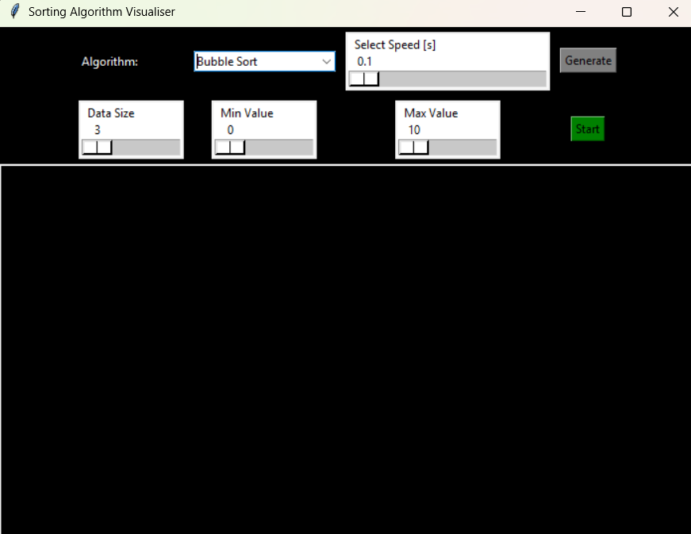
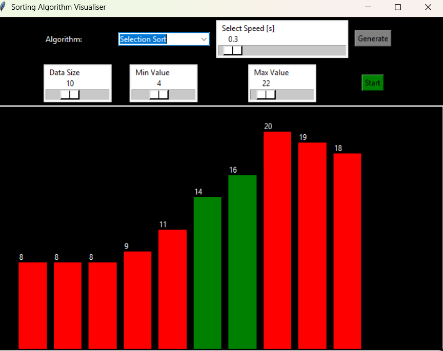
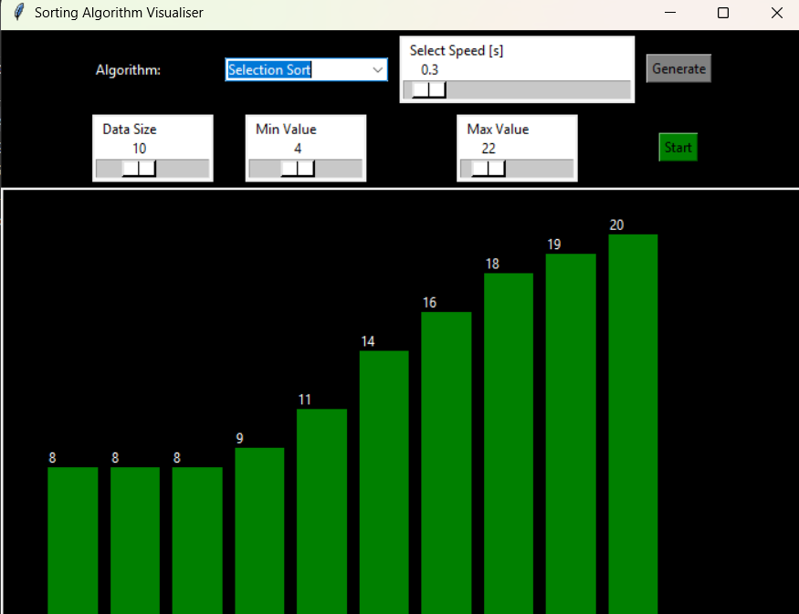

# Sorting Algorithm Visualizer

This project is a Python-based application that visualizes the working of various sorting algorithms using a Tkinter graphical interface.
It is designed to help users understand how sorting techniques operate step-by-step through real-time animations.

## Features

* Tkinter graphical interface
* Real-time visualization of sorting steps
* Adjustable sorting speed
* Adjustable number of elements
* Color-based representation of different states during sorting
* Audio alert when sorting is completed (Windows only)

## Technologies Used

* Python 3
* Tkinter
* Winsound (for optional sound alerts)

## Project Structure

```
SORTING-ALGORITHM-VISUALISER/
│── gui.py            # Main GUI and visualization code
│── sorting.py        # Sorting algorithm implementations
│── README.md         # Project documentation
│── assets/ (optional for images/screenshots)
```

## How to Run

1. Clone the repository

   ```
   git clone https://github.com/Sanchitaprajurkar/SORTING-ALGORITHM-VISUALISER.git
   ```

2. Open the project directory

   ```
   cd SORTING-ALGORITHM-VISUALISER
   ```

3. Run the application

   ```
   python gui.py
   ```

## Sorting Algorithms Included

* Bubble Sort
* Selection Sort
* Quick Sort
* Merge Sort

Each algorithm displays comparisons, swaps, partitioning (for Quick Sort), merging steps (for Merge Sort), and a final sorted view.

## Screenshots

### Application Interface






## Author

**Sanchita Rajurkar**
* GitHub: https://github.com/Sanchitaprajurkar
* LinkedIn: https://www.linkedin.com/in/sanchita-rajurkar-840180297/

